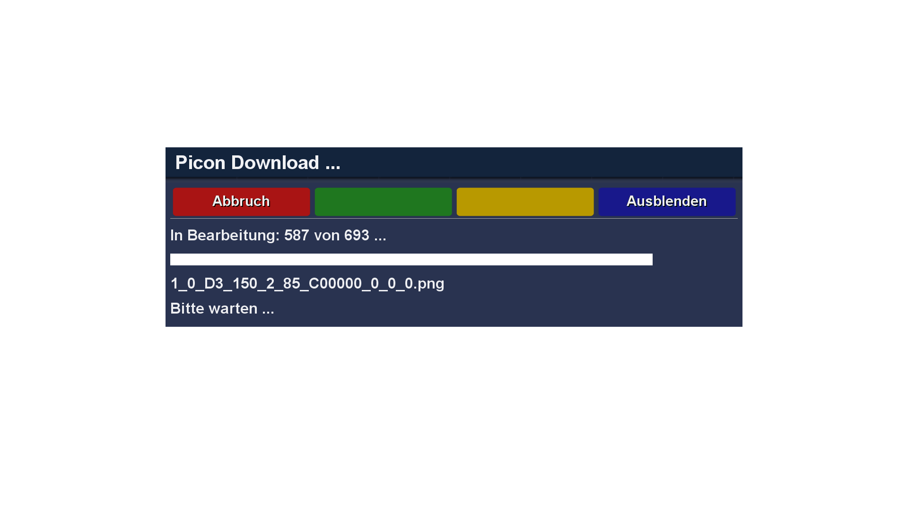

# PiconCockpit (PIC)

## Features
PiconCockpit is a plugin for DreamOS receivers that downloads picons from a picon server.

## Limitations
- PIC is being tested on DM 920 and DM ONE only

## Installation
To install PiconCockpit execute the following command in a console on your dreambox:
- apt-get install wget (required the first time only)
- wget https://dream-alpha.github.io/PiconCockpit/piconcockpit.sh -O - | /bin/sh

The installation script will also install a feed source that enables a convenient upgrade to the latest version with the following commands or automatically as part of a DreamOS upgrade:
- apt-get update
- apt-get upgrade

## Languages
- english
- german
- italian (by Spaeleus)

## Links
- Support: https://github.com/dream-alpha/PiconCockpit/discussions
- Feed: https://gemfury.com/dream-alpha
